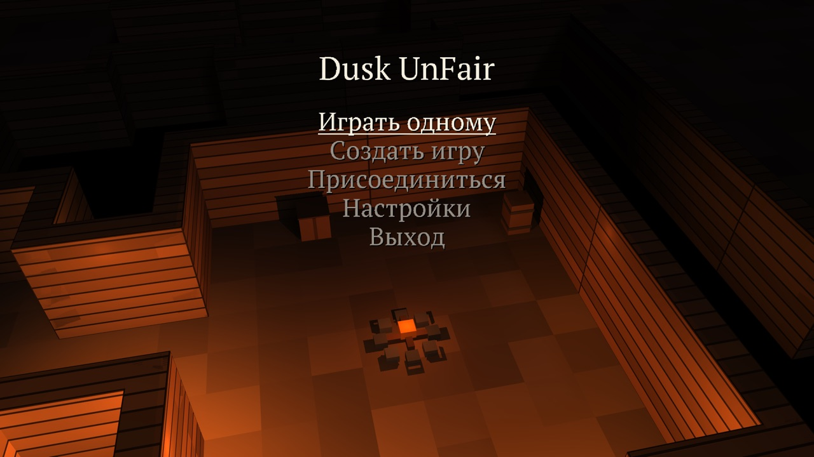
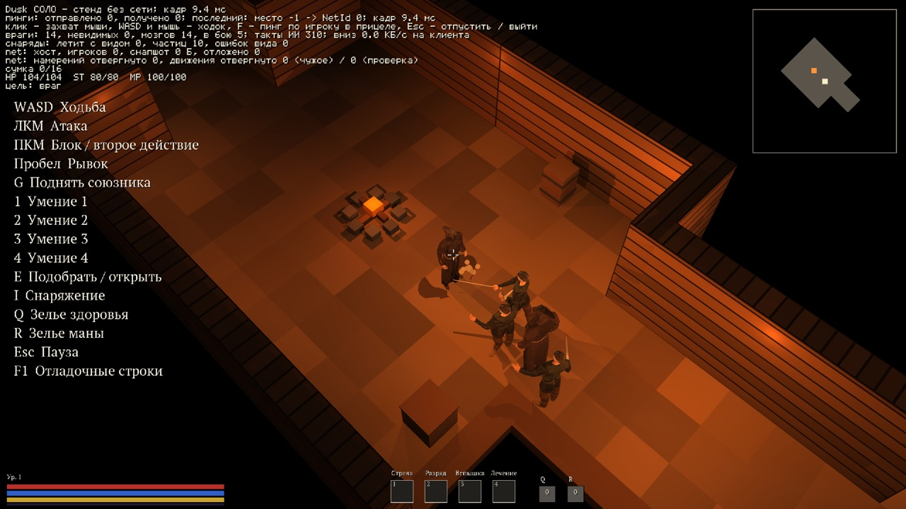
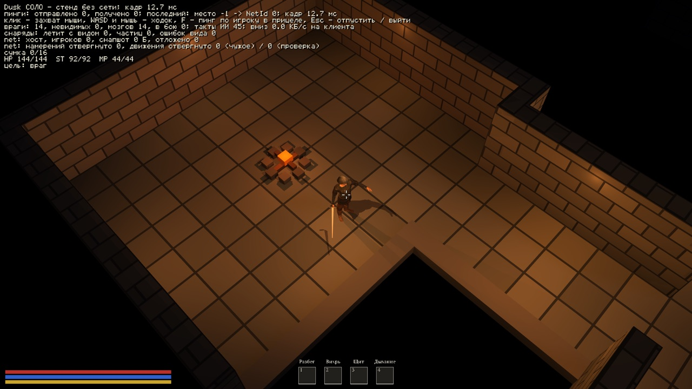
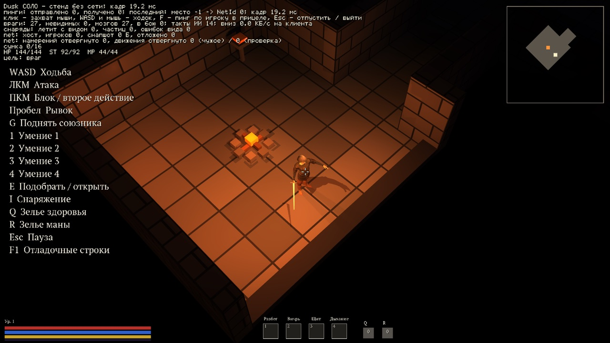
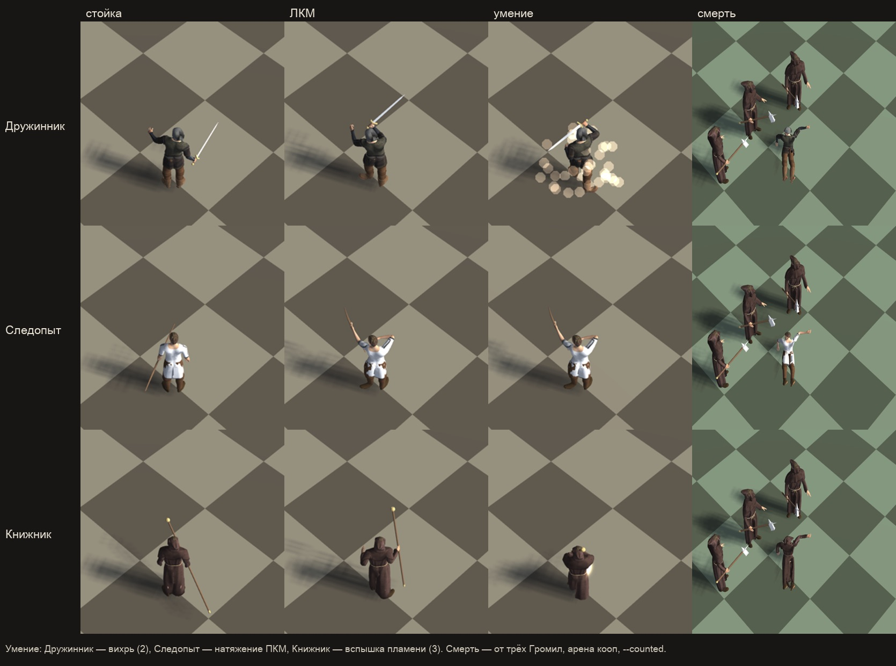

# Dusk UnFair — блог разработки

Кооперативный экшен-рогалик на 1–4 игроков с видом сверху под углом: три яруса подземелья одним забегом, три класса с десятками умений, толпы монстров, элита и боссы, предметы и уровни, сеть через Steam. Мир целиком трёхмерный. Первый релиз — приоритет студии. Игра работает на движке [dfn](https://github.com/SpiralGameStudios/dfn-devlog).

*Главное меню поверх живой комнаты первого яруса: костёр, брёвна, камера медленно облетает.*

| | |
|:---:|:---:|
|  |  |

*Три яруса: Разбойничьи шахты (брёвна, ящики и бочки), Катакомбы трясины (кирпич, вода по щиколотку, гробы и цепи), Цитадель сумрака (чёрный камень, жаровни, алтари). Подземелье собирается из комнат и коридоров по зерну, миникарта открывается по мере прохождения.*

*Три класса — Дружинник, Следопыт, Книжник: стойка, удар, умение, смерть. Тела, одежда и клипы — из общего конвейера персонажей движка.*

## Что уже есть

- Забег: три яруса подряд, ворота логова, босс каждого яруса, лестница вниз, привал в святилище, экран итога.
- Три класса с оружием в руках (меч и щит, лук, посох), 20 умений по слотам, рывок с неуязвимостью, зелья на быстрых клавишах.
- Девять типов монстров, элита с аффиксами, три босса (Атаман Кривой Нож, Мать трясины, Владыка сумрака) — первые фазы.
- Предметы четырёх редкостей с аффиксами, лут с врагов и из сундуков, инвентарь с подсказкой и сравнением, опыт и 15 уровней.
- Читаемость боя: полоски здоровья, числа урона, полоса босса, кольцо под целью, частицы, тряска камеры, реакции и смерти клипами.
- Звук: удары, касты, шаги по материалу яруса, окружение и костёр, реверб по ярусу.
- Кооп: хост авторитетен; клиент видит лут, сундуки, опыт, элиту, бой босса, эффекты; вход по адресу из меню.
- Запуск одной командой (`scripts/play.sh`), переносимый билд для другой машины (`scripts/package.sh`), 40+ автоматических приборов без окон.

## Статус — 26 сентября 2026

- Игра развёрнута с «арены от первого лица» на рогалик с видом сверху за одну ночь: 60+ изменений в игре, 10 в движке (камера вида сверху, генератор подземелий, слой действий с петлями и удержанием, крепление оружия к кости) и 10 в паке персонажей (40 клипов ударов, 21 клип действий, пак оружия).
- Дальше — плейтест владельца и правки по нему.

## Планы

1. Фазы боссов, поведение монстров сверх удара (невидимость Тени, телепорт Культиста).
2. Музыка своим пайплайном, полировка одежды и стоек.
3. Steam: страница, сборка с подписью, кооп-плейтест на двух машинах.

## Записи

- **2026-09-26, ночь → утро.** Разворот на «диабло»: камера вида сверху с прицелом мышью, подземелье трёх ярусов из данных (комнаты, коридоры, факелы, вода, декор, сундуки, ворота логова, лестницы, привал, итог), три класса с телами и клипами (меч, лук с натяжением, посох с площадным кастом, рывок), девять монстров и элита с аффиксами, три босса, предметы и лут, инвентарь, опыт и уровни, HUD с полосками/числами/миникартой, пауза и настройки, звук, кооп-репликация и поле адреса, переносимый билд. Сеттинг — `docs/DUSK_SETTING.md`.
- **2026-09-26, ночь.** Машина состояний забега: этапы и переходы описаны данными, хост ведёт переходы, клиент получает этап репликой; свой Steam App ID — параметр сборки. Настройки игры переезжают в стандартную папку пользователя.
- **2026-09-25, ночь.** Шесть ступеней детализации бойцов: от полной модели до «палок» и «силуэта» вдали. 1000 тел на арене-замере: 27,5 → 6,6 мс. Контент игры находится рядом с бинарём — выпуск заработает с любой машины.
- **2026-09-25, поздний вечер.** Уровни детализации тел: четыре ступени, 34,5 → 3,4 тыс. треугольников на бойца; на 4,5 м вторая ступень отличается от полной на 0,13 % заметных пикселей. 30 тел в арене — треугольников втрое меньше, GPU 10,0 → 9,2 мс; дальше кадр упирается в процессор (анимация). Ключ `--no-hud` для чистых кадров.
- **2026-09-25, вечер.** Враги Dusk — больше не коробки: тела из общего конвейера персонажей движка, с одеждой и походкой. Первый видимый кусок «персонажи как в Yaan».
- **2026-09-25.** Dusk UnFair — отдельный репозиторий. Запуск игры переведён на общий хост движка; ключи стенда отделены от ключей игры.
- **2026-09-23.** Первый кусок костяка: этапы забега описаны данными, хост ведёт переходы, клиент получает этап репликой.

## Архив

| | |
|:---:|:---:|
|  |  |

*Ранний прототип от первого лица: тестовая арена, враги-болванки и те же враги телами.*
