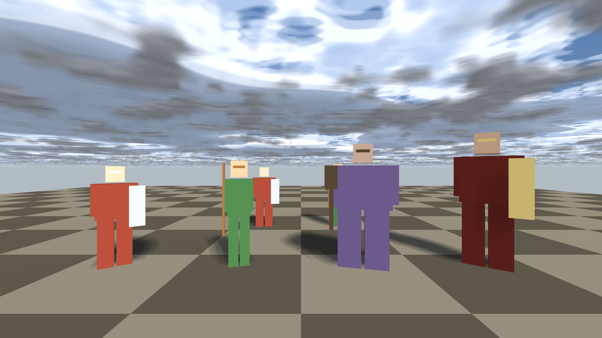
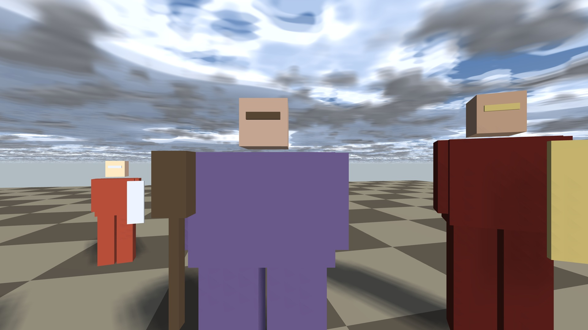
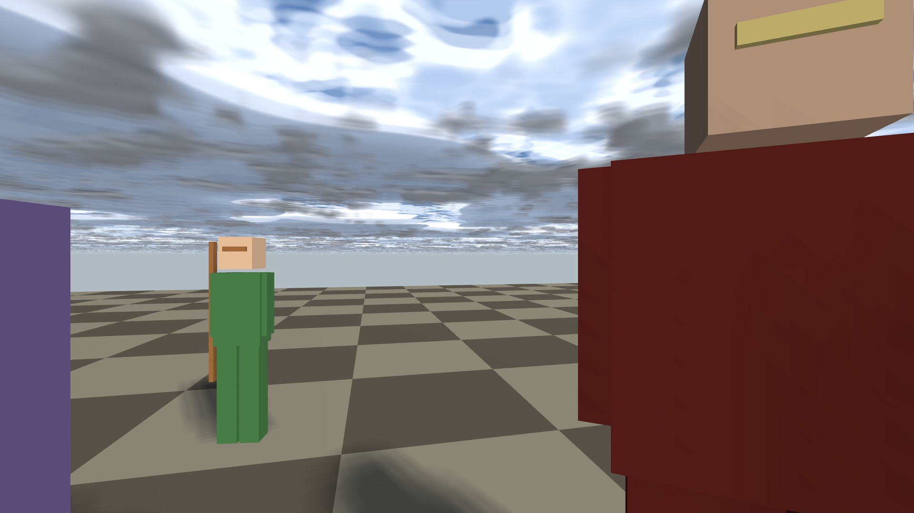
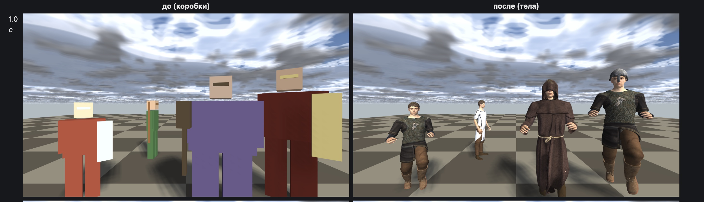

# Dusk UnFair — блог разработки

Кооперативный боевик на 1–4 игроков от первого лица: забег по этапам, толпы врагов и боссы, привал между квестами, сеть через Steam. Первый релиз — приоритет студии. Игра работает на движке [dfn](https://github.com/SpiralGameStudios/dfn-devlog).

| | |
|:---:|:---:|
|  |  |

*Ранний прототип: тестовая арена с шестью типами врагов, облачное небо, тени в реальном времени. Ниже — те же враги уже телами.*

*Слева — арена до, враги-болванки. Справа — те же шесть врагов телами из общего конвейера персонажей движка: одежда, лица, походка. Кадр 1,0 с, один и тот же бинарь до и после правки.*

## Что уже есть

- Хост игры, модули боя, способности и эффекты, ИИ врагов, боссы.
- Сеть: хост авторитетен, клиенты получают реплику; локальная петля для тестов и Steam для игры.
- Запуск через общий хост движка: окно, ввод, рендер, физика и звук — как у Yaan.
- 13 автоматических тестов, среди них кадр арены побитово.

## Статус — сентябрь 2026

- Dusk UnFair — отдельный репозиторий, собирается из чистого клона, движок приезжает сам по зафиксированной версии.
- Записана карта «костяка» игры: 12 кусков от машины состояний забега до итогового экрана, с оценками.
- Решено: персонажи Dusk будут такими же, как в Yaan, — тела с анимацией вместо болванок; атака как слой действия в движке, клипы и тайминги — в данных игры.

## Планы

1. Персонажи: общее хранение тел (сейчас ~35 МБ на тело), анимация атаки и реакции.
2. Атака, реакция на удар, смерть — видно у хоста и у клиента.
3. Машина состояний забега из данных, спавнер врагов, карта квеста с маркерами.
4. Экраны: меню, пауза, настройки, итог забега.

## Записи

- **2026-09-25, ночь.** Шесть ступеней детализации бойцов: от полной модели до «палок» и «силуэта» вдали. 1000 тел на арене-замере: 27,5 → 6,6 мс. Контент игры находится рядом с бинарём — выпуск заработает с любой машины.
- **2026-09-25, поздний вечер.** Уровни детализации тел: четыре ступени, 34,5 → 3,4 тыс. треугольников на бойца; на 4,5 м вторая ступень отличается от полной на 0,13 % заметных пикселей. 30 тел в арене — треугольников втрое меньше, GPU 10,0 → 9,2 мс; дальше кадр упирается в процессор (анимация). Ключ `--no-hud` для чистых кадров.
- **2026-09-25, вечер.** Враги Dusk — больше не коробки: тела из общего конвейера персонажей движка, с одеждой и походкой. Первый видимый кусок «персонажи как в Yaan».
- **2026-09-25.** Dusk UnFair — отдельный репозиторий. Запуск игры переведён на общий хост движка; ключи стенда отделены от ключей игры.
- **2026-09-23.** Первый кусок костяка: этапы забега описаны данными, хост ведёт переходы, клиент получает этап репликой.

