# Dusk UnFair — блог разработки

Кооперативный экшен-рогалик на 1–4 игроков с видом сверху под углом: три яруса подземелья одним забегом, три класса с десятками умений, толпы монстров, элита и боссы, предметы и уровни, сеть через Steam. Мир целиком трёхмерный. Первый релиз — приоритет студии. Игра работает на движке [dfn](https://github.com/SpiralGameStudios/dfn-devlog).

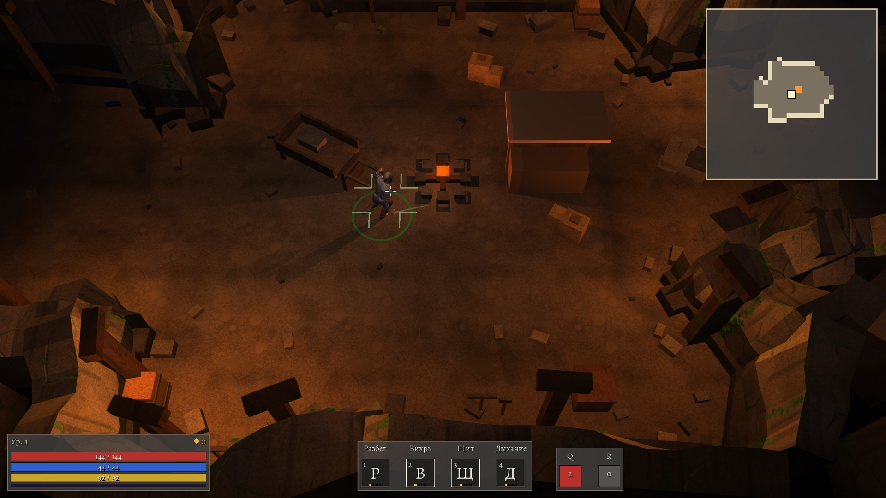

*Ярус 1 после ночи 27 сентября: пещера вместо комнаты-коробки — скала лентой по контуру с трещинами, потёками и мхом, крепь из брёвен, россыпь по полу, лианы; над пустотой — верх скалы, чёрных углов под свободной камерой нет.*

| | |
|:---:|:---:|
| 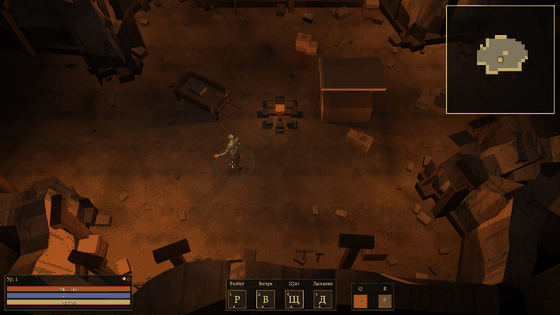 | 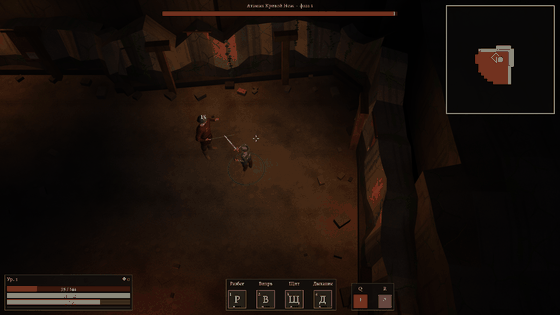 |

*Управление как в Dota: ПКМ — идти (маркер на земле, путь по ярусу), ПКМ по врагу — подойти и бить, A + ЛКМ — атака с ходу, ЛКМ — выбрать юнита. Герои и враги за стенами видны силуэтом, стены не прозрачные.*

| | |
|:---:|:---:|
| 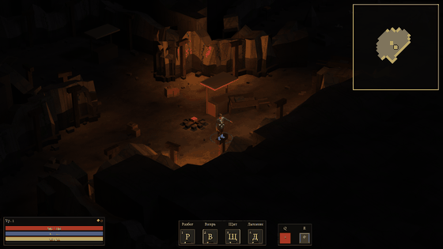 | 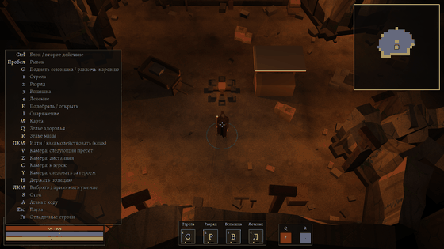 |

*Свободная камера по умолчанию (края экрана, колесо, C — к герою, Y — следование) и восемь пресетов вида на V/Z; спуск — три яруса одним забегом.*

| | |
|:---:|:---:|
| 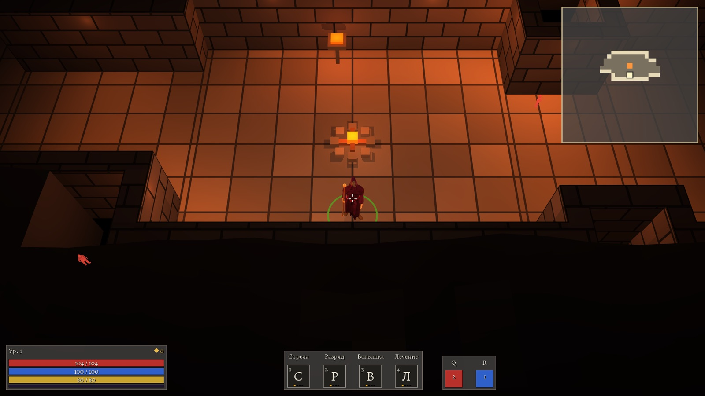 | 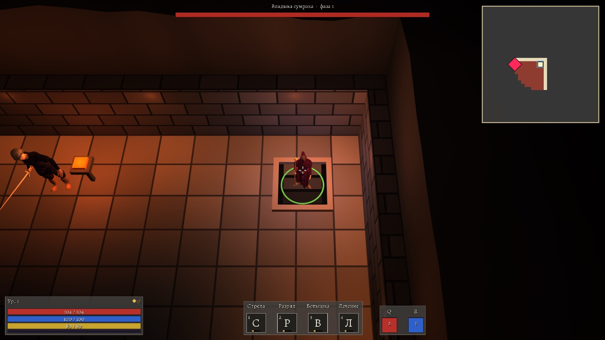 |

*Ярус 2 — Катакомбы трясины, ярус 3 — Цитадель сумрака и её логово с Владыкой.*

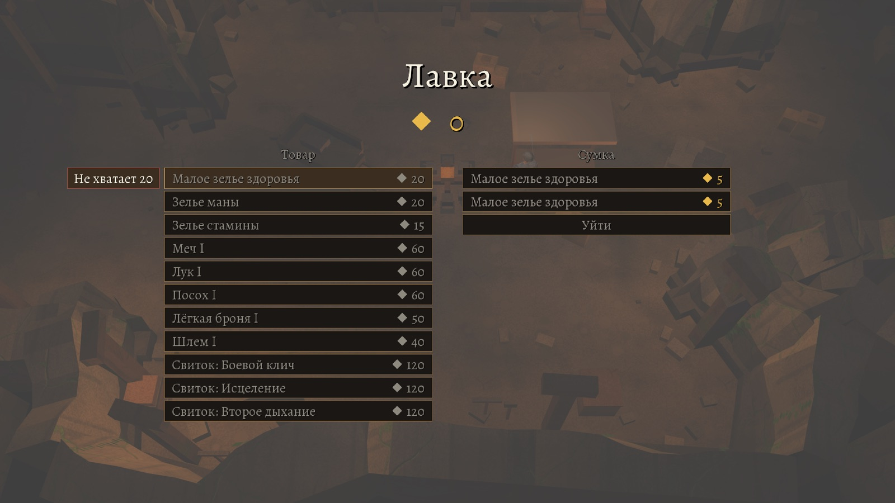

*Лавка у костра: ПКМ по прилавку — герой подходит и открывает торговлю; золото с убитых, свитки умений, продажа из сумки.*

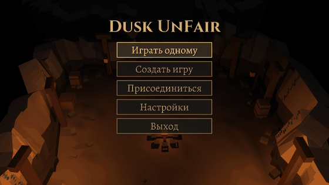

*Приложение: заставка, меню на фоне живой комнаты, выбор класса, сбор, ярус.*

## Что уже есть

- Забег: три яруса подряд, ворота логова, босс каждого яруса, лестница вниз, привал в святилище, экран итога.
- Три класса с оружием в руках (меч и щит, лук, посох), 20 умений по слотам, рывок с неуязвимостью, зелья на быстрых клавишах.
- Девять типов монстров, элита с аффиксами, три босса (Атаман Кривой Нож, Мать трясины, Владыка сумрака) — первые фазы.
- Предметы четырёх редкостей с аффиксами, лут с врагов и из сундуков, инвентарь с подсказкой и сравнением, опыт и 15 уровней.
- Читаемость боя: полоски здоровья, числа урона, полоса босса, кольцо под целью, частицы, тряска камеры, реакции и смерти клипами.
- Звук: удары, касты, шаги по материалу яруса, окружение и костёр, реверб по ярусу.
- Кооп: хост авторитетен; клиент видит лут, сундуки, опыт, элиту, бой босса, эффекты; вход по адресу из меню.
- Запуск одной командой (`scripts/play.sh`), переносимый билд для другой машины (`scripts/package.sh`), 40+ автоматических приборов без окон.

## Статус — 27 сентября 2026

- За вторую ночь — 55 изменений в игре, 3 в движке (силуэт за геометрией, рельеф у меша, порты сегментов), 2 в паке персонажей: разворот управления и камеры на Dota, пещеры с деталями и сегментами, лавки и золото, боссы со второй и третьей фазой, кооп-провода ко всему новому.
- Дальше — плейтест владельца на сборке 1b1bdcd и правки по нему; сегменты S2/S4/S5 (высоты, открытые сегменты с флорой, все 20).

## Планы

1. Фазы боссов, поведение монстров сверх удара (невидимость Тени, телепорт Культиста).
2. Музыка своим пайплайном, полировка одежды и стоек.
3. Steam: страница, сборка с подписью, кооп-плейтест на двух машинах.

## Записи

- **2026-09-27, ночь.** После первого плейтеста владельца — управление и вид как в Dota: ПКМ идти/атаковать с поиском пути по ярусу, ЛКМ выбор с панелью юнита, клавиша + ЛКМ — способность, A/S/H, подход на дальность умения, ПКМ по прилавку/жаровне/лестнице — дойти и применить; свободная камера с краями экрана и восемь пресетов, камера едет за телепортом и спуском; герои и враги за стенами силуэтом, стены не прозрачные; тело поворачивается к ходу, а не наклоняется. Пространство: пещеры вместо коробок (скала лентой, раструбы, карманы, обвалы, крепь), текстуры с трещинами, потёками, мхом и лианами, десять сегментов четырёх стилей с портами и стыковкой по ним, крышка скалы над пустотой — «чёрных углов» под свободной камерой 0,9 % лучей вместо 19 %, детали яруса 1 россыпью, свет логова яруса 2. Экономика: золото и опыт с убитых, очки умений и ранги как в Dota, лавки у костра и в святилищах со свитками умений, экран торговца. Боссы: Мать трясины ф2 (тотемы из воды), Владыка сумрака ф2 (жаровни гаснут, свет — урон ×1,5) и ф3 (Затмение с отсчётом и вуалью), свечение элит цветом аффикса, облики и идлы девяти типов врагов, имена боссов. UI: без подписей под кнопками, каменные плашки и бронзовый логотип, экраны до игры на фоне комнаты, HP-полоса врага крупнее со снятым куском, кольца на земле. Кооп: ранги, лавка, жаровни и затмение по сети. Сторожа «пустого мира» и журнал на каждый запуск. Записка сегментов — `docs/SEGMENTS.md`.
- **2026-09-26, ночь → утро.** Разворот на «диабло»: камера вида сверху с прицелом мышью, подземелье трёх ярусов из данных (комнаты, коридоры, факелы, вода, декор, сундуки, ворота логова, лестницы, привал, итог), три класса с телами и клипами (меч, лук с натяжением, посох с площадным кастом, рывок), девять монстров и элита с аффиксами, три босса, предметы и лут, инвентарь, опыт и уровни, HUD с полосками/числами/миникартой, пауза и настройки, звук, кооп-репликация и поле адреса, переносимый билд. Сеттинг — `docs/DUSK_SETTING.md`.
- **2026-09-26, ночь.** Машина состояний забега: этапы и переходы описаны данными, хост ведёт переходы, клиент получает этап репликой; свой Steam App ID — параметр сборки. Настройки игры переезжают в стандартную папку пользователя.
- **2026-09-25, ночь.** Шесть ступеней детализации бойцов: от полной модели до «палок» и «силуэта» вдали. 1000 тел на арене-замере: 27,5 → 6,6 мс. Контент игры находится рядом с бинарём — выпуск заработает с любой машины.
- **2026-09-25, поздний вечер.** Уровни детализации тел: четыре ступени, 34,5 → 3,4 тыс. треугольников на бойца; на 4,5 м вторая ступень отличается от полной на 0,13 % заметных пикселей. 30 тел в арене — треугольников втрое меньше, GPU 10,0 → 9,2 мс; дальше кадр упирается в процессор (анимация). Ключ `--no-hud` для чистых кадров.
- **2026-09-25, вечер.** Враги Dusk — больше не коробки: тела из общего конвейера персонажей движка, с одеждой и походкой. Первый видимый кусок «персонажи как в Yaan».
- **2026-09-25.** Dusk UnFair — отдельный репозиторий. Запуск игры переведён на общий хост движка; ключи стенда отделены от ключей игры.
- **2026-09-23.** Первый кусок костяка: этапы забега описаны данными, хост ведёт переходы, клиент получает этап репликой.

## Архив

| | |
|:---:|:---:|
| 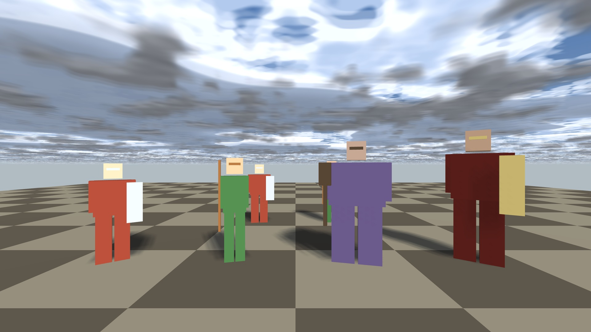 | 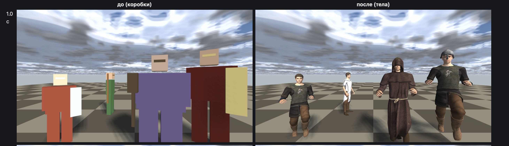 |

*Ранний прототип от первого лица: тестовая арена, враги-болванки и те же враги телами.*
